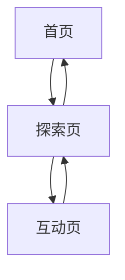

## 1. Product Overview
湖州城市探索应用是一个互动式导览平台，帮助用户发现湖州的景点、美食和文化特色。
- 为游客和当地居民提供直观的城市探索体验，解决信息碎片化问题
- 展示湖州的旅游价值，促进当地文化传播

## 2. Core Features

### 2.1 User Roles
| Role | Registration Method | Core Permissions |
|------|---------------------|------------------|
| Visitor | No registration required | Browse attractions, view details, submit ratings |

### 2.2 Feature Module
1. **首页**: 城市概览、热门景点、特色美食
2. **探索页**: 地图导览、分类筛选、详情查看
3. **互动页**: 游客评价、照片分享、打卡功能

### 2.3 Page Details
| Page Name | Module Name | Feature description |
|-----------|-------------|---------------------|
| 首页 | 城市概览 | 展示湖州简介、特色标签、天气信息 |
| 首页 | 热门景点 | 轮播展示热门景点图片和名称 |
| 首页 | 特色美食 | 展示当地特色美食列表 |
| 探索页 | 地图导览 | 交互式地图展示景点位置，支持缩放和点击 |
| 探索页 | 分类筛选 | 按类型（景点、美食、文化）筛选内容 |
| 探索页 | 详情查看 | 点击地点显示详细信息、图片、评分 |
| 互动页 | 游客评价 | 查看和提交地点评价 |
| 互动页 | 照片分享 | 上传和查看地点照片 |
| 互动页 | 打卡功能 | 记录访问过的地点，生成打卡地图 |

## 3. Core Process
用户打开应用 → 浏览首页了解湖州概况 → 进入探索页查看地图和详情 → 在互动页分享体验和查看他人评价

## 4. User Interface Design
### 4.1 Design Style
- 主色调: 湖蓝色 (#4A90E2) 和绿色 (#50C878)
- 按钮风格: 圆角按钮，有轻微阴影效果
- 字体: 无衬线字体，主标题 24px，副标题 18px，正文 14px
- 布局风格: 卡片式布局，顶部导航栏
- 图标风格: 扁平化图标，搭配湖州市花百合花元素

### 4.2 Page Design Overview
| Page Name | Module Name | UI Elements |
|-----------|-------------|-------------|
| 首页 | 城市概览 | 全屏背景图片，叠加半透明渐变，顶部导航栏，底部卡片式内容 |
| 首页 | 热门景点 | 横向滚动卡片，每张卡片包含景点图片、名称和简短描述 |
| 首页 | 特色美食 | 网格布局，每个美食项包含图片、名称和推荐指数 |
| 探索页 | 地图导览 | 全屏地图，顶部搜索栏，底部可滑动信息卡片 |
| 探索页 | 分类筛选 | 顶部标签式筛选器，点击切换不同分类 |
| 探索页 | 详情查看 | 模态框展示详细信息，包含图片轮播、描述、地址、评分 |
| 互动页 | 游客评价 | 列表式展示评价，包含用户头像、评分、评论内容和时间 |
| 互动页 | 照片分享 | 网格布局展示用户上传的照片，点击可放大查看 |
| 互动页 | 打卡功能 | 地图标记已打卡地点，生成打卡统计和分享卡片 |

### 4.3 Responsiveness
采用移动优先设计，适配桌面和平板设备。在小屏幕上优化布局，确保所有功能可正常使用。

### 4.4 3D Scene Guidance
无3D场景需求