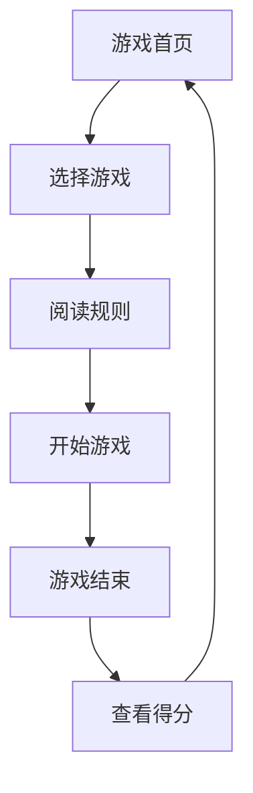

## 1. Product Overview
湖州创意互动小游戏集合是一个融合当地特色的休闲游戏平台，包含三款基于湖州文化元素的像素风格游戏。
- 为参与者提供有趣的互动体验，展示湖州的文化特色和旅游资源
- 适合在demowall活动中快速吸引用户参与，展示技术能力

## 2. Core Features

### 2.1 User Roles
| Role | Registration Method | Core Permissions |
|------|---------------------|------------------|
| Player | No registration required | Play games, view score rankings |

### 2.2 Feature Module
1. **游戏首页**: 游戏选择、规则说明、得分排行
2. **太湖捕鱼**: 点击抓鱼、得分计算、时间限制
3. **莫干山竹林探险**: 迷宫导航、障碍躲避、计时挑战
4. **湖笔书法挑战**: 模拟书法、笔画评分、作品保存

### 2.3 Page Details
| Page Name | Module Name | Feature description |
|-----------|-------------|---------------------|
| 游戏首页 | 游戏选择 | 展示三款游戏的图标和名称，点击进入对应游戏 |
| 游戏首页 | 规则说明 | 点击游戏图标后显示详细规则和操作方式 |
| 游戏首页 | 得分排行 | 显示各游戏的最高分和参与者昵称 |
| 太湖捕鱼 | 游戏界面 | 像素风格的太湖场景，鱼群游动，点击捕捉 |
| 太湖捕鱼 | 得分系统 | 根据鱼的大小和种类计算得分，实时显示 |
| 太湖捕鱼 | 时间限制 | 60秒游戏时间，倒计时结束后显示最终得分 |
| 莫干山竹林探险 | 迷宫界面 | 像素风格的竹林迷宫，玩家控制角色移动 |
| 莫干山竹林探险 | 导航系统 | 显示当前位置和出口方向，记录移动路径 |
| 莫干山竹林探险 | 计时挑战 | 记录完成迷宫的时间，挑战最佳成绩 |
| 湖笔书法挑战 | 书法界面 | 模拟宣纸和湖笔，支持鼠标/触摸书写 |
| 湖笔书法挑战 | 评分系统 | 根据笔画流畅度和相似度评分 |
| 湖笔书法挑战 | 作品保存 | 允许玩家保存和分享书法作品 |

## 3. Core Process
玩家打开应用 → 选择游戏 → 阅读规则 → 开始游戏 → 游戏结束 → 查看得分 → 返回首页选择其他游戏

## 4. User Interface Design
### 4.1 Design Style
- 主色调: 湖蓝色 (#4A90E2)、绿色 (#50C878) 和米黄色 (#F5E6D3)
- 按钮风格: 像素风格按钮，有复古游戏感
- 字体: 像素字体，游戏标题 28px，正文 16px
- 布局风格: 居中布局，游戏区域占主要屏幕
- 图标风格: 像素风格图标，融入湖州特色元素（太湖、竹林、湖笔）

### 4.2 Page Design Overview
| Page Name | Module Name | UI Elements |
|-----------|-------------|-------------|
| 游戏首页 | 游戏选择 | 三个大尺寸游戏图标，带有像素风格动画效果，悬停时显示游戏名称 |
| 游戏首页 | 规则说明 | 弹出式对话框，包含游戏规则和操作指南，配有简单示意图 |
| 游戏首页 | 得分排行 | 表格形式展示各游戏的前三名得分和玩家昵称 |
| 太湖捕鱼 | 游戏界面 | 蓝色背景模拟太湖，白色像素鱼群随机游动，点击效果为水花动画 |
| 太湖捕鱼 | 得分系统 | 右上角显示当前得分，捕获不同鱼类有不同得分动画 |
| 太湖捕鱼 | 时间限制 | 顶部显示倒计时，时间结束时有游戏结束动画 |
| 莫干山竹林探险 | 迷宫界面 | 绿色背景模拟竹林，棕色像素墙构成迷宫，玩家为小动物形象 |
| 莫干山竹林探险 | 导航系统 | 小地图显示迷宫概览和当前位置，路径以虚线标记 |
| 莫干山竹林探险 | 计时挑战 | 顶部显示计时器，完成时显示用时和排名 |
| 湖笔书法挑战 | 书法界面 | 米黄色背景模拟宣纸，黑色线条模拟湖笔，书写时有墨水扩散效果 |
| 湖笔书法挑战 | 评分系统 | 书写完成后显示评分动画和具体得分，指出优缺点 |
| 湖笔书法挑战 | 作品保存 | 提供保存按钮，可将作品转换为图片格式分享 |

### 4.3 Responsiveness
采用响应式设计，优先适配桌面和 tablet 设备，确保游戏操作区域足够大。在小屏幕设备上自动调整游戏元素大小和布局。

### 4.4 3D Scene Guidance
无3D场景需求