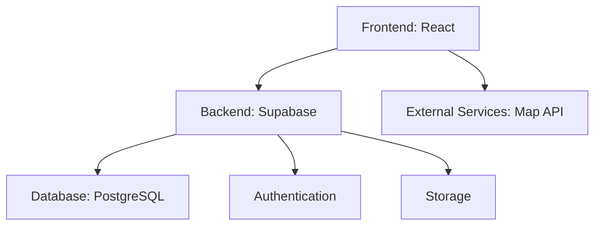

## 1.## 1. Architecture Design
```mermaid
graph TD## 1. Architecture Design
```mermaid
graph TD
  A[Frontend: React] --> B[Backend: Supabase]
  B## 1. Architecture Design
```mermaid
graph TD
  A[Frontend: React] --> B[Backend: Supabase]
  B --> C[Database: PostgreSQL]
  B --> D[Authentication]
  B --> E## 1. Architecture Design
```mermaid
graph TD
  A[Frontend: React] --> B[Backend: Supabase]
  B --> C[Database: PostgreSQL]
  B --> D[Authentication]
  B --> E[Storage]
  A --> F[External## 1. Architecture Design
```mermaid
graph TD
  A[Frontend: React] --> B[Backend: Supabase]
  B --> C[Database: PostgreSQL]
  B --> D[Authentication]
  B --> E[Storage]
  A --> F[External Services: Map API]
```

## 1. Architecture Design


## 2. Technology Description
- Frontend: React@18 + tailwindcss@## 1. Architecture Design


## 2. Technology Description
- Frontend: React@18 + tailwindcss@3 + vite
- Initialization Tool: vite## 1. Architecture Design


## 2. Technology Description
- Frontend: React@18 + tailwindcss@3 + vite
- Initialization Tool: vite-init
- Backend: Supabase
-## 1. Architecture Design


## 2. Technology Description
- Frontend: React@18 + tailwindcss@3 + vite
- Initialization Tool: vite-init
- Backend: Supabase
- Database: Supabase (PostgreSQL)
- Map Service: Leaflet.js

#### 1. Architecture Design


## 2. Technology Description
- Frontend: React@18 + tailwindcss@3 + vite
- Initialization Tool: vite-init
- Backend: Supabase
- Database: Supabase (PostgreSQL)
- Map Service: Leaflet.js

## 3. Route Definitions
| Route | Purpose |## 1. Architecture Design


## 2. Technology Description
- Frontend: React@18 + tailwindcss@3 + vite
- Initialization Tool: vite-init
- Backend: Supabase
- Database: Supabase (PostgreSQL)
- Map Service: Leaflet.js

## 3. Route Definitions
| Route | Purpose |
|-------|---------|
| / | 首页，展示城市概览、热门## 1. Architecture Design


## 2. Technology Description
- Frontend: React@18 + tailwindcss@3 + vite
- Initialization Tool: vite-init
- Backend: Supabase
- Database: Supabase (PostgreSQL)
- Map Service: Leaflet.js

## 3. Route Definitions
| Route | Purpose |
|-------|---------|
| / | 首页，展示城市概览、热门景点和特色美食 |
| /expl## 1. Architecture Design


## 2. Technology Description
- Frontend: React@18 + tailwindcss@3 + vite
- Initialization Tool: vite-init
- Backend: Supabase
- Database: Supabase (PostgreSQL)
- Map Service: Leaflet.js

## 3. Route Definitions
| Route | Purpose |
|-------|---------|
| / | 首页，展示城市概览、热门景点和特色美食 |
| /explore | 探索页，包含地图导览和分类筛选 |
| /interact## 1. Architecture Design


## 2. Technology Description
- Frontend: React@18 + tailwindcss@3 + vite
- Initialization Tool: vite-init
- Backend: Supabase
- Database: Supabase (PostgreSQL)
- Map Service: Leaflet.js

## 3. Route Definitions
| Route | Purpose |
|-------|---------|
| / | 首页，展示城市概览、热门景点和特色美食 |
| /explore | 探索页，包含地图导览和分类筛选 |
| /interact | 互动页，包含游客评价、照片## 1. Architecture Design


## 2. Technology Description
- Frontend: React@18 + tailwindcss@3 + vite
- Initialization Tool: vite-init
- Backend: Supabase
- Database: Supabase (PostgreSQL)
- Map Service: Leaflet.js

## 3. Route Definitions
| Route | Purpose |
|-------|---------|
| / | 首页，展示城市概览、热门景点和特色美食 |
| /explore | 探索页，包含地图导览和分类筛选 |
| /interact | 互动页，包含游客评价、照片分享和打卡功能 |

## 4. API Definitions
- 使用 Supabase## 1. Architecture Design


## 2. Technology Description
- Frontend: React@18 + tailwindcss@3 + vite
- Initialization Tool: vite-init
- Backend: Supabase
- Database: Supabase (PostgreSQL)
- Map Service: Leaflet.js

## 3. Route Definitions
| Route | Purpose |
|-------|---------|
| / | 首页，展示城市概览、热门景点和特色美食 |
| /explore | 探索页，包含地图导览和分类筛选 |
| /interact | 互动页，包含游客评价、照片分享和打卡功能 |

## 4. API Definitions
- 使用 Supabase 客户端 SDK 直接与数据库交互
-## 1. Architecture Design


## 2. Technology Description
- Frontend: React@18 + tailwindcss@3 + vite
- Initialization Tool: vite-init
- Backend: Supabase
- Database: Supabase (PostgreSQL)
- Map Service: Leaflet.js

## 3. Route Definitions
| Route | Purpose |
|-------|---------|
| / | 首页，展示城市概览、热门景点和特色美食 |
| /explore | 探索页，包含地图导览和分类筛选 |
| /interact | 互动页，包含游客评价、照片分享和打卡功能 |

## 4. API Definitions
- 使用 Supabase 客户端 SDK 直接与数据库交互
- 无需自定义 API 端点

## 5. Server Architecture Diagram
无后端服务器架构，## 1. Architecture Design


## 2. Technology Description
- Frontend: React@18 + tailwindcss@3 + vite
- Initialization Tool: vite-init
- Backend: Supabase
- Database: Supabase (PostgreSQL)
- Map Service: Leaflet.js

## 3. Route Definitions
| Route | Purpose |
|-------|---------|
| / | 首页，展示城市概览、热门景点和特色美食 |
| /explore | 探索页，包含地图导览和分类筛选 |
| /interact | 互动页，包含游客评价、照片分享和打卡功能 |

## 4. API Definitions
- 使用 Supabase 客户端 SDK 直接与数据库交互
- 无需自定义 API 端点

## 5. Server Architecture Diagram
无后端服务器架构，使用 Supabase 作为 BaaS 解决方案

## 6. Data Model
##### 1. Architecture Design


## 2. Technology Description
- Frontend: React@18 + tailwindcss@3 + vite
- Initialization Tool: vite-init
- Backend: Supabase
- Database: Supabase (PostgreSQL)
- Map Service: Leaflet.js

## 3. Route Definitions
| Route | Purpose |
|-------|---------|
| / | 首页，展示城市概览、热门景点和特色美食 |
| /explore | 探索页，包含地图导览和分类筛选 |
| /interact | 互动页，包含游客评价、照片分享和打卡功能 |

## 4. API Definitions
- 使用 Supabase 客户端 SDK 直接与数据库交互
- 无需自定义 API 端点

## 5. Server Architecture Diagram
无后端服务器架构，使用 Supabase 作为 BaaS 解决方案

## 6. Data Model
### 6.1 Data Model Definition
```mermaid
erDiagram
  ATTRACTIONS ||## 1. Architecture Design
```mermaid
graph TD
  A[Frontend: React] --> B[Backend: Supabase]
  B --> C[Database: PostgreSQL]
  B --> D[Authentication]
  B --> E[Storage]
  A --> F[External Services: Map API]
```

## 2. Technology Description
- Frontend: React@18 + tailwindcss@3 + vite
- Initialization Tool: vite-init
- Backend: Supabase
- Database: Supabase (PostgreSQL)
- Map Service: Leaflet.js

## 3. Route Definitions
| Route | Purpose |
|-------|---------|
| / | 首页，展示城市概览、热门景点和特色美食 |
| /explore | 探索页，包含地图导览和分类筛选 |
| /interact | 互动页，包含游客评价、照片分享和打卡功能 |

## 4. API Definitions
- 使用 Supabase 客户端 SDK 直接与数据库交互
- 无需自定义 API 端点

## 5. Server Architecture Diagram
无后端服务器架构，使用 Supabase 作为 BaaS 解决方案

## 6. Data Model
### 6.1 Data Model Definition
```mermaid
erDiagram
  ATTRACTIONS ||--o{ REVIEWS : has
## 1. Architecture Design
```mermaid
graph TD
  A[Frontend: React] --> B[Backend: Supabase]
  B --> C[Database: PostgreSQL]
  B --> D[Authentication]
  B --> E[Storage]
  A --> F[External Services: Map API]
```

## 2. Technology Description
- Frontend: React@18 + tailwindcss@3 + vite
- Initialization Tool: vite-init
- Backend: Supabase
- Database: Supabase (PostgreSQL)
- Map Service: Leaflet.js

## 3. Route Definitions
| Route | Purpose |
|-------|---------|
| / | 首页，展示城市概览、热门景点和特色美食 |
| /explore | 探索页，包含地图导览和分类筛选 |
| /interact | 互动页，包含游客评价、照片分享和打卡功能 |

## 4. API Definitions
- 使用 Supabase 客户端 SDK 直接与数据库交互
- 无需自定义 API 端点

## 5. Server Architecture Diagram
无后端服务器架构，使用 Supabase 作为 BaaS 解决方案

## 6. Data Model
### 6.1 Data Model Definition
```mermaid
erDiagram
  ATTRACTIONS ||--o{ REVIEWS : has
  ATTRACTIONS ||--o{ PHOT## 1. Architecture Design
```mermaid
graph TD
  A[Frontend: React] --> B[Backend: Supabase]
  B --> C[Database: PostgreSQL]
  B --> D[Authentication]
  B --> E[Storage]
  A --> F[External Services: Map API]
```

## 2. Technology Description
- Frontend: React@18 + tailwindcss@3 + vite
- Initialization Tool: vite-init
- Backend: Supabase
- Database: Supabase (PostgreSQL)
- Map Service: Leaflet.js

## 3. Route Definitions
| Route | Purpose |
|-------|---------|
| / | 首页，展示城市概览、热门景点和特色美食 |
| /explore | 探索页，包含地图导览和分类筛选 |
| /interact | 互动页，包含游客评价、照片分享和打卡功能 |

## 4. API Definitions
- 使用 Supabase 客户端 SDK 直接与数据库交互
- 无需自定义 API 端点

## 5. Server Architecture Diagram
无后端服务器架构，使用 Supabase 作为 BaaS 解决方案

## 6. Data Model
### 6.1 Data Model Definition
```mermaid
erDiagram
  ATTRACTIONS ||--o{ REVIEWS : has
  ATTRACTIONS ||--o{ PHOTOS : has
  ATTRACTIONS ||--## 1. Architecture Design
```mermaid
graph TD
  A[Frontend: React] --> B[Backend: Supabase]
  B --> C[Database: PostgreSQL]
  B --> D[Authentication]
  B --> E[Storage]
  A --> F[External Services: Map API]
```

## 2. Technology Description
- Frontend: React@18 + tailwindcss@3 + vite
- Initialization Tool: vite-init
- Backend: Supabase
- Database: Supabase (PostgreSQL)
- Map Service: Leaflet.js

## 3. Route Definitions
| Route | Purpose |
|-------|---------|
| / | 首页，展示城市概览、热门景点和特色美食 |
| /explore | 探索页，包含地图导览和分类筛选 |
| /interact | 互动页，包含游客评价、照片分享和打卡功能 |

## 4. API Definitions
- 使用 Supabase 客户端 SDK 直接与数据库交互
- 无需自定义 API 端点

## 5. Server Architecture Diagram
无后端服务器架构，使用 Supabase 作为 BaaS 解决方案

## 6. Data Model
### 6.1 Data Model Definition
```mermaid
erDiagram
  ATTRACTIONS ||--o{ REVIEWS : has
  ATTRACTIONS ||--o{ PHOTOS : has
  ATTRACTIONS ||--o{ CHECKINS : has
  
## 1. Architecture Design
```mermaid
graph TD
  A[Frontend: React] --> B[Backend: Supabase]
  B --> C[Database: PostgreSQL]
  B --> D[Authentication]
  B --> E[Storage]
  A --> F[External Services: Map API]
```

## 2. Technology Description
- Frontend: React@18 + tailwindcss@3 + vite
- Initialization Tool: vite-init
- Backend: Supabase
- Database: Supabase (PostgreSQL)
- Map Service: Leaflet.js

## 3. Route Definitions
| Route | Purpose |
|-------|---------|
| / | 首页，展示城市概览、热门景点和特色美食 |
| /explore | 探索页，包含地图导览和分类筛选 |
| /interact | 互动页，包含游客评价、照片分享和打卡功能 |

## 4. API Definitions
- 使用 Supabase 客户端 SDK 直接与数据库交互
- 无需自定义 API 端点

## 5. Server Architecture Diagram
无后端服务器架构，使用 Supabase 作为 BaaS 解决方案

## 6. Data Model
### 6.1 Data Model Definition
```mermaid
erDiagram
  ATTRACTIONS ||--o{ REVIEWS : has
  ATTRACTIONS ||--o{ PHOTOS : has
  ATTRACTIONS ||--o{ CHECKINS : has
  
  ATTRACTIONS {
    id UUID PK## 1. Architecture Design
```mermaid
graph TD
  A[Frontend: React] --> B[Backend: Supabase]
  B --> C[Database: PostgreSQL]
  B --> D[Authentication]
  B --> E[Storage]
  A --> F[External Services: Map API]
```

## 2. Technology Description
- Frontend: React@18 + tailwindcss@3 + vite
- Initialization Tool: vite-init
- Backend: Supabase
- Database: Supabase (PostgreSQL)
- Map Service: Leaflet.js

## 3. Route Definitions
| Route | Purpose |
|-------|---------|
| / | 首页，展示城市概览、热门景点和特色美食 |
| /explore | 探索页，包含地图导览和分类筛选 |
| /interact | 互动页，包含游客评价、照片分享和打卡功能 |

## 4. API Definitions
- 使用 Supabase 客户端 SDK 直接与数据库交互
- 无需自定义 API 端点

## 5. Server Architecture Diagram
无后端服务器架构，使用 Supabase 作为 BaaS 解决方案

## 6. Data Model
### 6.1 Data Model Definition
```mermaid
erDiagram
  ATTRACTIONS ||--o{ REVIEWS : has
  ATTRACTIONS ||--o{ PHOTOS : has
  ATTRACTIONS ||--o{ CHECKINS : has
  
  ATTRACTIONS {
    id UUID PK
    name String
    type String
## 1. Architecture Design
```mermaid
graph TD
  A[Frontend: React] --> B[Backend: Supabase]
  B --> C[Database: PostgreSQL]
  B --> D[Authentication]
  B --> E[Storage]
  A --> F[External Services: Map API]
```

## 2. Technology Description
- Frontend: React@18 + tailwindcss@3 + vite
- Initialization Tool: vite-init
- Backend: Supabase
- Database: Supabase (PostgreSQL)
- Map Service: Leaflet.js

## 3. Route Definitions
| Route | Purpose |
|-------|---------|
| / | 首页，展示城市概览、热门景点和特色美食 |
| /explore | 探索页，包含地图导览和分类筛选 |
| /interact | 互动页，包含游客评价、照片分享和打卡功能 |

## 4. API Definitions
- 使用 Supabase 客户端 SDK 直接与数据库交互
- 无需自定义 API 端点

## 5. Server Architecture Diagram
无后端服务器架构，使用 Supabase 作为 BaaS 解决方案

## 6. Data Model
### 6.1 Data Model Definition
```mermaid
erDiagram
  ATTRACTIONS ||--o{ REVIEWS : has
  ATTRACTIONS ||--o{ PHOTOS : has
  ATTRACTIONS ||--o{ CHECKINS : has
  
  ATTRACTIONS {
    id UUID PK
    name String
    type String
    description Text
    address String
    latitude Float
    longitude Float
    rating Float
