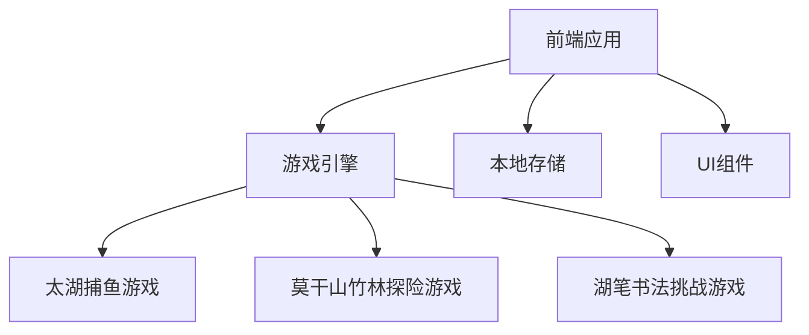
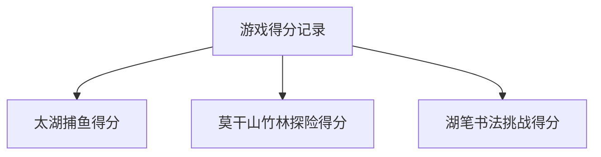

## 1. Architecture Design


## 2. Technology Description
- Frontend: React@18 + tailwindcss@3 + vite
- Initialization Tool: vite-init
- Backend: None (使用本地存储)
- Database: LocalStorage (存储游戏得分和配置)

## 3. Route Definitions
| Route | Purpose |
|-------|---------|
| / | 游戏首页 |
| /fishing | 太湖捕鱼游戏 |
| /maze | 莫干山竹林探险游戏 |
| /calligraphy | 湖笔书法挑战游戏 |

## 4. API Definitions
无后端API需求，使用本地存储实现数据持久化。

## 5. Server Architecture Diagram
无后端服务器架构需求。

## 6. Data Model
### 6.1 Data Model Definition


### 6.2 Data Definition Language
使用LocalStorage存储以下数据结构：

```javascript
// 得分记录
const scores = {
  fishing: [
    { name: "玩家1", score: 1200, time: "2026-04-11T10:00:00" },
    { name: "玩家2", score: 950, time: "2026-04-11T10:05:00" }
  ],
  maze: [
    { name: "玩家1", time: 45, date: "2026-04-11T10:10:00" },
    { name: "玩家2", time: 60, date: "2026-04-11T10:15:00" }
  ],
  calligraphy: [
    { name: "玩家1", score: 85, date: "2026-04-11T10:20:00" },
    { name: "玩家2", score: 70, date: "2026-04-11T10:25:00" }
  ]
};

// 游戏配置
const gameConfig = {
  fishing: {
    duration: 60, // 游戏时长（秒）
    fishTypes: [
      { name: "小鱼", score: 10, speed: 2 },
      { name: "中鱼", score: 20, speed: 1.5 },
      { name: "大鱼", score: 30, speed: 1 }
    ]
  },
  maze: {
    width: 20,
    height: 15,
    start: { x: 0, y: 0 },
    end: { x: 19, y: 14 }
  },
  calligraphy: {
    characters: ["湖", "州", "太", "湖", "竹", "林"],
    difficulty: 3 // 1-5
  }
};
```